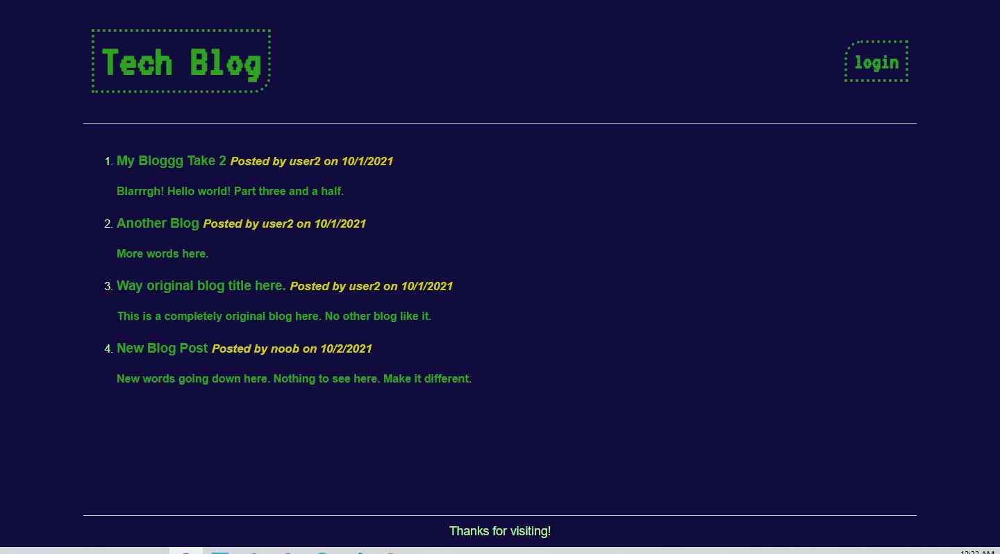

 
  # Tech Blog
  

  ## Table of Contents
  * [Description](#description)
  * [Install](#install)
  * [Use](#use)
  * [License](#license)
  * [Contributing](#contributing)
  * [Tests](#tests)
  * [Questions](#questions)

  ## Description
  Tech Blog generates a server that allows users to create accounts where they can post, edit, and delete blogs from the dashboard. Users can interact with blogs by posting, editing, or deleting comments on the blog.

  

  ## Install
  To generate the server, use the commands:    
  `npm install express-handlebars`   
  `npm install --save mysql2`     
  `npm i sequelize`   
  `npm install dotenv`    
  `npm install bcrypt`   
  `npm install express-session`   
  `npm install connect-session-sequelize`   
  to install the appropriate node packages.
  
  ## Use
  Use the command `npm start` or `node server` and the server will generate the site at http://localhost:3001/
  
  ## License
  No license.

  ## Contributing
  

  ## Tests
  Use the jest package to run test. Use  `npm install jest` and ensure the test setting is set to jest in your package.json file. Use `npm run test` command to run the test and ensure the helper functions pass.
  
  ## Questions
  - [Github for mattersievers](http://www.github.com/mattersievers)
  - For further questions, contact me through email at mattersievers@gmail.com

